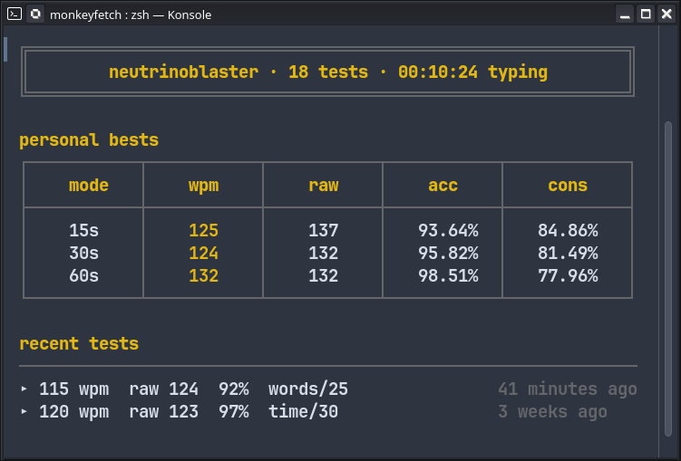

# monkeyfetch

a CLI tool that fetches your typing data from [Monkeytype](https://monkeytype.com) and pretty-prints it in the terminal.

Shows your personal bests, recent tests, and account stats.

_Requires terminal with true color support._



## Installation

**Pre-compiled binary** (no Rust required):

Download the binary for your platform from the [Releases](https://github.com/unaimeds/monkeyfetch/releases) page, extract, and place it somewhere on your `$PATH`.

**From crates.io:**

```sh
cargo install monkeyfetch
```

**From source:**

```sh
git clone https://github.com/unaimeds/monkeyfetch
cd monkeyfetch
cargo build --release
./target/release/monkeyfetch
```

## Configuration

Create the config file at:

- **Linux/macOS**: `~/.config/monkeyfetch/config.toml`
- **macOS**: `$HOME/Library/Application Support/monkeyfetch/config.toml`
- **Windows**: `%APPDATA%\monkeyfetch\config.toml`

```toml
api_key = "your_api_key_here"
```

### Getting your Monkeytype API key

1. Log in to [monkeytype.com](https://monkeytype.com)
2. Go to **Account settings → ape keys**
3. Generate a new key and paste it in the config

## Usage

```sh
monkeyfetch                  # use cached data if fresh (< 15 min)
monkeyfetch --force          # bypass cache, fetch directly from API
monkeyfetch --config <path>  # use a custom config file path
```

## License

Project licensed under MIT, see [LICENSE](LICENSE) file.
